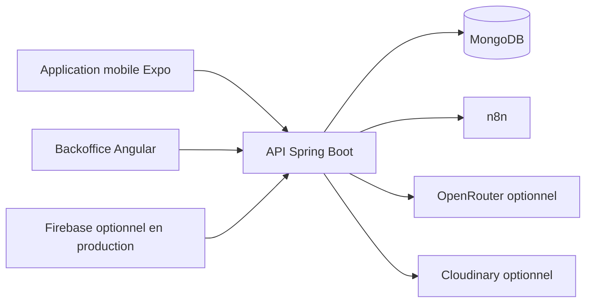

# Interlance

> Interlance est l’évolution du projet Smart Match, une plateforme intelligente de stages et missions freelance.

## English Summary

Interlance is a full-stack internship and freelance matching platform designed for candidate, recruiter, and administrator workflows. It includes a Spring Boot backend, Angular backoffice, React Native mobile app, MongoDB persistence, Docker-based local setup, Swagger documentation, role-based access, notifications, company validation, applications, and matching-oriented features.

This repository demonstrates backend architecture, REST API design, role-based systems, mobile/web integration, admin workflows, documentation, security basics, and deployment preparation.

## Présentation

Interlance est un projet full stack académique qui met en relation des candidats, étudiants et freelances avec des recruteurs et des entreprises. La plateforme centralise la publication de stages et missions freelance, le suivi des candidatures, la validation des entreprises et une assistance intelligente au matching.

## Problématique

La recherche de stage ou de mission est souvent fragmentée entre messageries, réseaux sociaux et fichiers partagés. Les recruteurs doivent de leur côté traiter manuellement les candidatures. Interlance propose un parcours unique, traçable et adapté aux rôles de chaque utilisateur.

## Objectifs

- Centraliser les offres de stage et les missions freelance.
- Permettre aux candidats de rechercher, enregistrer et suivre leurs candidatures depuis le mobile.
- Donner aux recruteurs les outils pour gérer entreprise, offres et candidatures.
- Fournir aux administrateurs un backoffice de validation, modération et suivi.
- Proposer une IA responsable qui recommande et explique, sans prendre de décision finale.
- Permettre une exécution locale avec Docker sans dépendre de Firebase.

## Utilisateurs

| Rôle | Responsabilités principales |
|---|---|
| Candidat | Profil, recherche, favoris, candidatures, notifications, Premium et recommandations. |
| Recruteur | Profil recruteur, entreprise, offres, candidatures reçues et échanges. |
| Administrateur | Tableau de bord, utilisateurs, entreprises, offres, abonnements et journaux. |

## Architecture et technologies

| Couche | Technologies |
|---|---|
| Backend | Java 17, Spring Boot 3, Spring Security, Spring Data MongoDB, Swagger/OpenAPI, Maven |
| Base de données | MongoDB et Mongo Express |
| Backoffice | Angular, Angular Material, Nginx |
| Mobile | Expo, React Native, TypeScript |
| Automatisation et IA | n8n, OpenRouter avec fallback local |
| Stockage | Cloudinary optionnel, stockage local de CV en mode local |
| Déploiement | Docker Compose, Kubernetes et Nginx |



Firebase est prévu pour la production. Le mode local Compose active une authentification de démonstration explicite et des données seed, ce qui permet de travailler sans projet Firebase.

## Fonctionnalités principales

### Candidat

- Créer ou compléter un profil et renseigner ses compétences.
- Parcourir, filtrer et enregistrer des offres.
- Postuler et suivre le statut des candidatures.
- Consulter les notifications.
- Accéder aux fonctions Premium et aux recommandations IA lorsque disponibles.

### Recruteur

- Gérer son profil et son entreprise.
- Créer, modifier, publier ou archiver une offre.
- Consulter les candidatures reçues et mettre à jour leur statut.
- Échanger avec un candidat lorsque le chat est disponible.

### Administrateur

- Consulter les indicateurs du tableau de bord.
- Gérer les utilisateurs et les entreprises.
- Valider les entreprises et modérer les offres.
- Consulter abonnements, paiements, notifications et journaux selon les droits.

## Lancer le projet localement

### Avec Docker Compose

```bash
docker compose up -d --build
```

Si le plugin Compose v2 est indisponible :

```bash
docker-compose up -d --build
```

Vérification :

```bash
docker ps
docker logs --tail=80 smart-match-platform-backend
```

Services disponibles :

| Service | Adresse |
|---|---|
| Backend | `http://localhost:8080` |
| Swagger UI | `http://localhost:8080/swagger-ui/index.html` |
| Backoffice | `http://localhost:4200` |
| Mongo Express | `http://localhost:8081` |
| n8n | `http://localhost:5678` |

### Application mobile Expo Web

```bash
cd smart-match-mobile
npm install
echo "EXPO_PUBLIC_API_BASE_URL=http://localhost:8080/api" > .env
npx expo start --web --port 8082
```

Ouvrir ensuite `http://localhost:8082`. Le fichier `.env` est local et privé : ne jamais le committer.

## Données de démonstration

Les comptes synthétiques, entreprises, offres, candidatures, paiements, résultats IA et placeholders textuels sont documentés dans [docs/demo-data.md](docs/demo-data.md).

Les données seed ne contiennent aucune URL externe de photo ou logo. Les interfaces affichent automatiquement des initiales ou un badge lisible lorsque aucune image est fournie.

## Documentation technique

- [Architecture technique](docs/architecture.md)
- [Design patterns](docs/design-patterns.md)
- [Guide installation et configuration](docs/installation-guide.md)
- [Résumé API et Swagger](docs/api-summary.md)
- [Schéma MongoDB](docs/database-schema.md)
- [Guide utilisateur](docs/user-guide.md)
- [Données de démonstration](docs/demo-data.md)
- [Checklist finale](docs/final-checklist.md)
- [Déploiement Docker et Kubernetes](deployment/README.md)

## Sécurité

- Les rôles `CANDIDATE`, `RECRUITER` et `ADMIN` sont contrôlés côté backend.
- Firebase Authentication est utilisé en production ; le mode local sans Firebase est limité à Compose et aux comptes synthétiques.
- Les fichiers uploadés sont validés par type, taille et chemin.
- Les secrets sont fournis par variables environnement et ne sont jamais versionnés.
- Ne jamais committer un fichier `.env`, un compte de service Firebase ou une clé API.

Consulter aussi la [documentation sécurité](docs/security.md) et le [flux de paiement](docs/payment-flow.md).

## Déploiement

Le répertoire [deployment](deployment/README.md) décrit les services Docker et les manifests Kubernetes disponibles. Avant toute mise en production, configurer MongoDB sécurisé, HTTPS, Firebase Admin, Cloudinary, OpenRouter, n8n et les secrets de paiement dans une plateforme de gestion de secrets.

## Portfolio Value

- Multi-role full-stack platform with candidate, recruiter, and admin use cases.
- Spring Boot REST API with MongoDB, Swagger, security boundaries, and Docker setup.
- Angular backoffice and React Native mobile application connected to the same backend.
- Documentation depth suitable for internship interviews and academic review.
- Clear demonstration of digital transformation in recruitment and freelance workflows.

## Licence et cadre académique

Ce dépôt est préparé pour une présentation académique. Les paiements, données et résultats IA de démonstration ne correspondent à aucun utilisateur réel ni à aucune transaction réelle.
