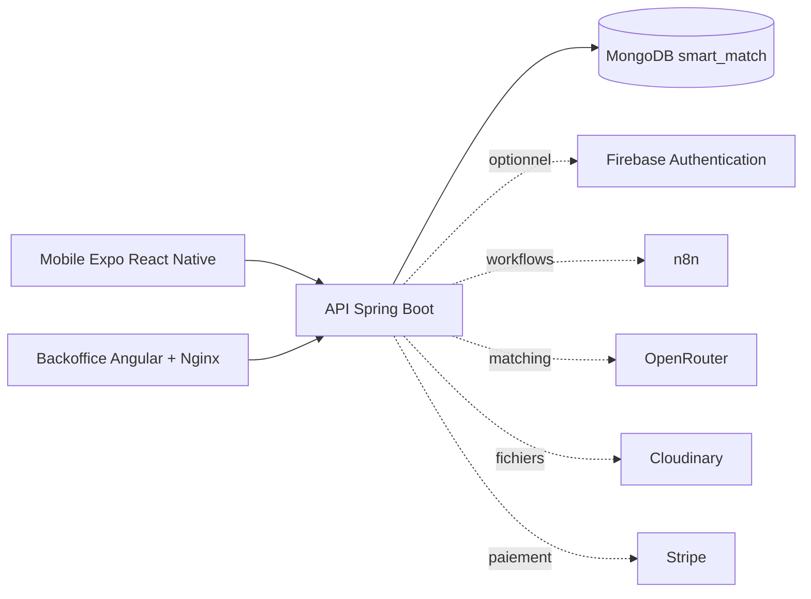

# Interlance — Architecture

> Cette section est la référence pour la démonstration locale Docker. Firebase, n8n, OpenRouter et Cloudinary restent des intégrations optionnelles : leur absence ne doit pas empêcher les parcours seed de fonctionner.

## Architecture globale

Interlance regroupe une application mobile Expo React Native pour candidats et recruteurs, un backoffice Angular servi par Nginx, et une API REST Spring Boot. L’API porte les règles métier, la sécurité, les notifications et l’intégration aux services externes. MongoDB stocke les documents métier dans la base `smart_match`.

## Composants et responsabilités

| Composant | Responsabilité |
|---|---|
| Mobile Expo | Parcours candidat et recruteur, appels REST/WebSocket, mode démo et Firebase en production. |
| Backoffice Angular | Administration, gestion recruteur, tableaux, formulaires et routes protégées. |
| Nginx | Sert le build Angular dans le conteneur backoffice et ajoute des en-têtes HTTP de base. |
| Spring Boot | API REST, règles métier, RBAC, uploads, paiements, matching et Swagger/OpenAPI. |
| MongoDB | Persistance documentaire des utilisateurs, profils, offres, candidatures, paiements, notifications et conversations. |
| n8n | Orchestration de workflows d’assistant, scoring et matching lorsque les webhooks sont configurés. |
| OpenRouter | Fournisseur optionnel de modèle pour le matching et l’analyse de CV. |
| Cloudinary | Stockage optionnel d’images et CV ; un stockage local est conservé pour la démo. |
| Firebase | Authentification de production par token ID ; non requis dans le Docker local de démonstration. |

## Choix techniques

- **Spring Boot** : conventions fortes, écosystème Spring Security/Data, validation et documentation OpenAPI intégrée.
- **MongoDB** : modèle flexible adapté aux profils, listes de compétences, offres et historiques ; les références par identifiant gardent les modules découplés.
- **Angular + Angular Material** : backoffice structuré, composants cohérents et PWA.
- **Expo React Native** : un code TypeScript pour mobile et Web, rapide à lancer en démonstration.
- **n8n** : workflows visibles et modifiables sans embarquer l’orchestration dans le client mobile.
- **Cloudinary** : abstraction de stockage d’assets prête pour le cloud ; désactivable localement.
- **Docker Compose** : lancement reproductible des services techniques sans dépendance à une installation MongoDB locale.
- **Kubernetes** : manifests disponibles pour une démonstration Minikube/cluster, mais le Docker Compose reste le chemin local recommandé.

## Mode démo local sans Firebase

Le Compose racine active `APP_DEMO_AUTH_ENABLED=true` et le seeder. Le mobile et le backoffice reconnaissent les comptes de démonstration, puis transmettent une identité de démo au backend. Le filtre Spring Security charge alors l’utilisateur seed correspondant. Firebase Admin n’est donc pas nécessaire pour parcourir la démo locale.

En production, ce mécanisme doit être désactivé et remplacé par Firebase Authentication : le client envoie un token Bearer, Firebase Admin le vérifie et le backend résout l’utilisateur local.

## Déploiement

Le `docker-compose.yml` racine démarre MongoDB, Mongo Express, backend, backoffice et n8n. Les manifests `smart-match-backend/deployment/k8s/` fournissent namespace, ConfigMap, Secret exemple, services, déploiements, probes, ressources et PVC. Ils sont une base de démonstration, pas une configuration de production complète.

## Components

The platform is composed of three main applications and two external services:

- **Mobile app**: Expo React Native app used by candidates and recruiters.
- **Backoffice**: Angular PWA used by admins and recruiters.
- **Backend**: Spring Boot REST API exposing business modules and security rules.
- **MongoDB**: document database storing users, profiles, offers, applications and analytics.
- **Firebase Authentication**: identity provider for email/password authentication.

## Request Flow

1. User signs in with Firebase from mobile or backoffice.
2. Frontend receives a Firebase ID token.
3. Frontend sends API requests to Spring Boot with `Authorization: Bearer <firebase_id_token>`.
4. Backend Firebase filter validates the token using Firebase Admin SDK.
5. Backend loads the local user from MongoDB using `firebaseUid`.
6. Controllers and services execute business rules based on `CANDIDATE`, `RECRUITER` or `ADMIN` role.
7. Data is persisted in MongoDB and responses are returned as DTOs.

## Role-Based Access Control

- Public users can list and view published offers.
- Candidates can manage candidate profile, applications, favorites, subscriptions, intelligent matching features and notifications.
- Recruiters can manage company, recruiter profile, offers and received applications.
- Admins can validate companies, manage users, moderate offers, view analytics, subscriptions and logs.

## Deployment View

Docker Compose runs MongoDB, backend, backoffice and Mongo Express. Kubernetes manifests are provided for Minikube using a namespace, MongoDB service, backend service, ConfigMap and Secret example.
