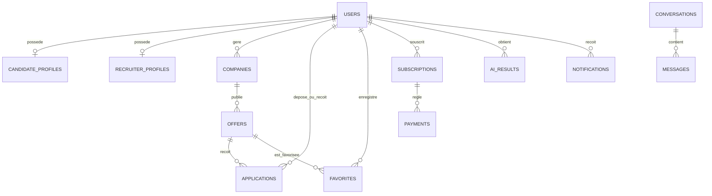

# Interlance — Database Schema

> Base MongoDB de la démo : `smart_match`. MongoDB stocke des documents ; les liens ci-dessous sont des identifiants de référence gérés par l'application, et non des clés étrangères SQL.

## Collections et relations principales

| Collection | Rôle | Références principales |
|---|---|---|
| `users` | Compte, rôle, plan et état d'activation. | `firebaseUid`, e-mail ; un profil selon le rôle. |
| `candidate_profiles` | Compétences, CV et préférences du candidat. | `userId` → `users`. |
| `recruiter_profiles` | Fonction et rattachement professionnel du recruteur. | `userId` → `users`, éventuellement `companyId` → `companies`. |
| `companies` | Entreprise créée par un recruteur et validée par un admin. | propriétaire/recruteur → `users`. |
| `offers` | Offre de stage ou mission freelance. | `companyId` → `companies`, recruteur → `users`. |
| `applications` | Candidature et son statut. | `offerId` → `offers`, candidat/recruteur → `users`. |
| `favorites` | Offre enregistrée par un candidat. | `userId` → `users`, `offerId` → `offers`. |
| `subscriptions` | Plan Premium et période de validité. | `userId` → `users`. |
| `payments` | Tentative ou confirmation de paiement. | utilisateur et souscription associés. |
| `ai_results` | Résultat, score et recommandation de matching/IA. | utilisateur, offre ou candidature selon le traitement. |
| `notifications` | Notification affichée à un utilisateur. | `userId` → `users`. |
| `conversations` et `messages` | Chat disponible lorsque le parcours le permet. | participants, offre/candidature ; `conversationId` → `conversations`. |

`chat_messages` est parfois employé comme nom fonctionnel dans une documentation ; dans l'implémentation actuelle, les messages sont stockés dans la collection `messages`.

## Index et règles d'unicité

Les modèles déclarent notamment l'unicité de `users.firebaseUid` et de l'e-mail, un profil candidat/recruteur par `userId`, une candidature unique par couple offre/candidat, un favori unique par couple utilisateur/offre et une conversation unique pour une offre et ses participants. Des index de consultation sont également prévus sur les références d'offres, candidatures, notifications et messages afin de servir les listes par utilisateur et les flux chronologiques.

MongoDB stores data as documents. Collection names in code use snake case where configured.

## users

Stores Firebase-linked user accounts: `firebaseUid`, `fullName`, `email`, `role`, `plan`, `active`, `emailVerified`, timestamps.

## candidateProfiles

Candidate profile data: `userId`, education, field, location, CV URL, skills, languages, preferences.

## recruiterProfiles

Recruiter profile data: `userId`, `companyId`, position, phone.

## companies

Company data: recruiter owner, name, sector, description, logo, website, validation status.

## offers

Offer data: company, title, description, type, location, duration, required skills, status, publish/archive dates.

## applications

Candidate applications: offer, candidate, recruiter, message, status, matching score, dates.

## favorites

Candidate saved offers: `userId`, `offerId`, created date.

## subscriptions

Premium plans: user, plan, active flag, start/expiration dates, status.

## payments

Payment records linked to subscription and user: amount, currency, method, status, paid date.

## notifications

User notifications: user, title, message, type, read flag, created date.

## aiResults

Simulated AI outputs: user, offer/application references, type, score, skills, recommendation and details.

## adminLogs

Admin audit trail: admin id, action, target type/id, description, created date.

## analytics

Generated dashboard snapshots: totals for users, candidates, recruiters, offers, applications, premium users, companies, pending companies/offers/applications.
